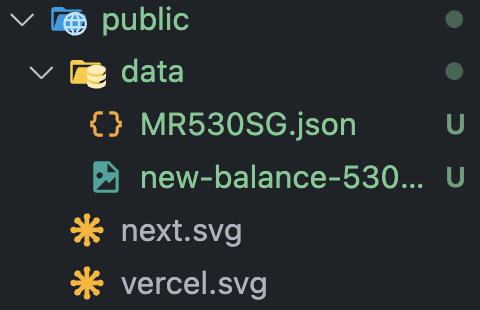

## Getting Started

First, import the relevant data to `public/data` (the data should be the files already sent via email, such as the picture and the json file)



Then, run the development server:

```bash
npm run dev
# or
yarn dev
# or
pnpm dev
# or
bun dev
```

Open [http://localhost:3000](http://localhost:3000) with your browser to see the result.

## Process

- August 1st 2024 `(4 hours) 4pm - 8pm`
  - Inititialized this project
  - Made a crude, non-finished layout
- August 2nd 2024 `(4 hours 20 minutes) 12pm - 4.20pm`
  - Finished the layout
  - Started organizing and tidying up the layout
  - Incorporated dummy data, removed hard code values
